# amiga-esp-link

This document uses the awesome esp-link firmware available here:<br />
https://github.com/jeelabs/esp-link <br />

With the wifi-serial bridge we can connect a PC and an Amiga together just like with a null-modem cable (PC ⇄ Amiga) but without having to use a physical cable between the machines.

***

<a href="pics/amiga-esp-link_pic28.jpg">

</a>

***
Demo video here:<br />
https://drive.google.com/file/d/1JXnxcCOAw7E6R6TP7SXa89liKBrgprrN/view?usp=sharing

***

The esp-link will make it possible to do file transfers over Wi-Fi from the PC to the Amiga and vice versa using a file transfer protocol like `Zmodem` or `Kermit` on each end. A popular program for doing this on the Amiga was [Ncomm](https://aminet.net/search?query=ncomm) back in the days. On the PC side we can use for example `Tera Term` (Windows) or `Minicom` (Linux).<br />

***

It's also possible to get Console output of diagrom displayed from your Amiga to your PC this way. No cable needed :)<br />

No driver needs to be installed on the Amiga side as long as you don't want to replace the `serial.device` that comes with AmigaOS. A better replacement is `8n1.device` available in two versions on Aminet here: https://aminet.net/search?query=8n1  <br />
one is for AmigaDOS 2.04+ (ONLY V37+), pick the correct one for your system. I have successfully used the `8n1.device` driver at `38400` baud speed setting on a plain standard A500 with some fast ram installed.


### Installing esp-link firmware

***

1. We start by flashing the esp-link to our esp8266 board.<br /> I'm going to do that with the `Flash Download Tools` available from Espressif.<br />
   First download the Expressif download tool for esp8266 from their site:<br /><br />
   https://www.espressif.com/en/support/download/other-tools <br /><br />
   <a href="pics/amiga-esp-link_pic1.jpg">
   
   </a><br />

***

2. Now hook up your ESP8266-board to your PC. I'm using a LoLin NodeMCU V3 board here, pay attention to what COM-port it gets in your system. Mine got COM3 in Windows. You may have to install drivers for the CH340 USB-to-UART bridge chip or whatever chip your module uses for this to work.<br /><br />
   <a href="pics/amiga-esp-link_pic2.jpg">
   
   </a><br />
   
***
   
3. Now start the Flash Tool and select `ESP8266` and `Develop`<br /><br />
   <a href="pics/amiga-esp-link_pic3.jpg">
   
   </a><br />

***

4. Ok, good now we follow the instructions on what files to download and put in to our flash download tool. I downloaded the latest stable release `esp-link v3.0.14-g963ffbb` but I could probably have chosen the latest alpha-release instead<br />
   https://github.com/jeelabs/esp-link/blob/master/FLASHING.md#initial-serial-flashing
   <br />

***

5. Now flash the device usign the Flash Tool, it's important to untick the `DoNotChgBin`-checkbox and put in the correct hex-addresses and COM-port to match your board.<br /><br /> 
   <a href="pics/amiga-esp-link_pic4.jpg">
   
   </a><br />

***

### Configuring esp-link to STA-mode
6. If the flashing went well then push the reset-button on your ESP-device and it should now boot and start blinking to show it's now setup as an AP (AccessPoint). You should now be able to connect to it by using for example your phone. Put in a manual IP-address on the same subnet as the AP (192.168.4.0/24). The AP is set to `192.168.4.1` by default so your phone can be set to for example `192.168.4.2` with a netmask of `255.255.255.0`<br /><br />
   
   <a href="pics/amiga-esp-link_pic5.jpg">
   
   </a><br />
   <br />
   You should now be able to connect to it:<br />
   <br />
   <a href="pics/amiga-esp-link_pic6.jpg">
   
   </a>
   <br />

***

7. Now point your browser to `http://192.168.4.1` and you should see the esp-link homepage, we now want to put the device into `STA-mode` (Station-mode) so that it can join our home-wifi-network and get an IP from our home router instead so that we can access this page from our PC. Put the device in `AP + STA`-mode and click the `Wifi Station` and select your wifi-network and put in your `WPA2`-password and connect. Do NOT connect to `SkyNet` or `The Sausage Cartel` :)
   <br />
   <br />
   <a href="pics/amiga-esp-link_pic7.jpg">
   
   </a>
   <a href="pics/amiga-esp-link_pic8.jpg">
   
   </a>
   <br />
   <br />
   After verifying you are connected to your wifi-network, notice what IP-address you got from the router (I got `192.168.1.22` here), now switch to STA-mode by pressing the "*Switch to `STA-mode`*" link:
   <br />
   <br />
   <a href="pics/amiga-esp-link_pic9.jpg">
   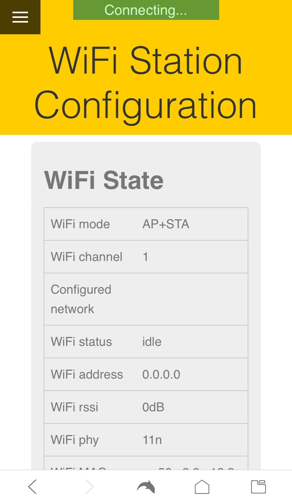
   </a>
   <a href="pics/amiga-esp-link_pic10.jpg">
   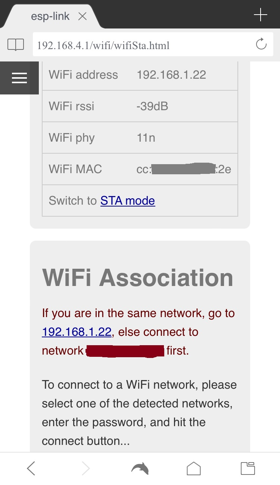
   </a>
   <br />
   <br />
   After pressing the "*Switch to `STA-mode`*" link the phone access to the esp-link homepage is now gone (since the 192.168.4.1 AP is not there any more). Now remove this connection from your phone and try and access the esp-link homepage through your browser on your PC.
   <br />
   <br />
   Yay! it worked, now press the home tab and configure the *Pin Assignment* according to how you want it. This is how I configured it:
   <br />
   <br />
   <a href="pics/amiga-esp-link_pic11.jpg">
   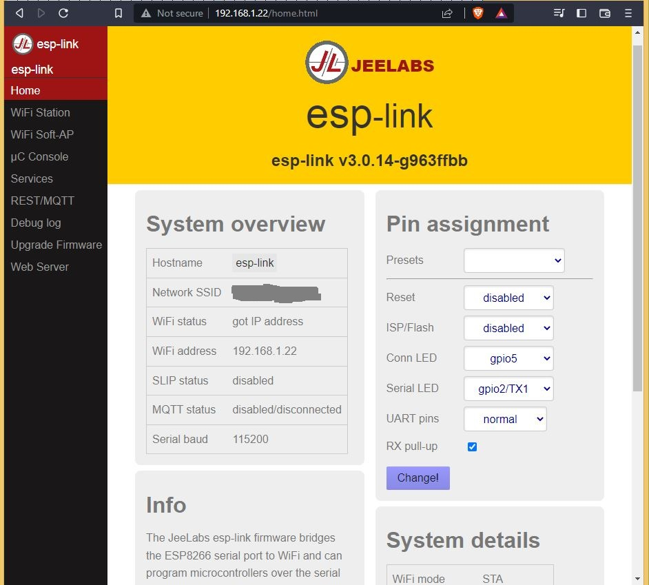
   </a>
   <br />
   In order to avoid avoid ROM boot message I choose "swapped" here which uses UART 2 pins instead, TX (TXD2) on gpio15 and RX (RXD2) on gpio13.
   <br />

   Explanation of Pin assignment (options above)
   ---------
   Name  | Description
   -|-|
   Reset | Connect to µC reset pin for programming and reset-µC function 
   ISP/Flash | Second signal to program µC. AVR:not used, esp8266:gpio2, ARM:ISP
   Conn LED | LED to show WiFi connectivity
   Serial LED | LED to show serial activity
   UART pins | Swap UART0 pins to avoid ROM boot message. Normal is TX on gpio1/TX0 and RX on gpio3/RX0, swapped is TX on gpio15 and RX on gpio13.
   RX pull-up | Enable internal 40K pull-up on RX
   
   Pinout for the module I'm using for esp-link, LoLin NodeMCU V3:<br />
   <br />
   <a href="pics/amiga-esp-link_pic12.jpg">
   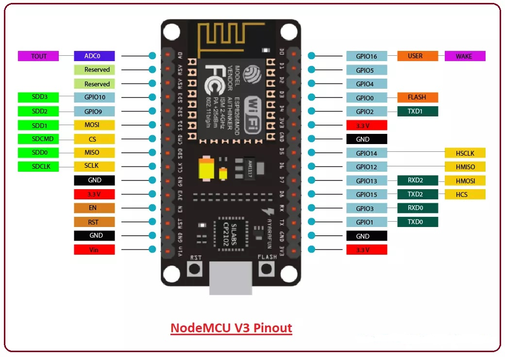   
   </a>
   <br />

***

### Installing a virtual serial port on PC

8. In order to transfer serial data over TCP/IP we need to install a virtual serial port that can redirect serial data to network traffic. For this I install HW VSP3 on my Windows Machine. There are other solutions for this as well.
   <br />
   <br />
   https://www.hw-group.com/software/hw-vsp3-virtual-serial-port
   <br />
   <br /> 
   HW VSP is a software driver that adds a virtual serial port (e.g. COM5) to the operating system and redirects the data from this port via a TCP/IP network to another hardware interface, which is specified by its IP address and port number.
   <br />
   <br />
   Installing and configuring HW VSP3:<br />
   <br />
   Download and install latest version of HW VSP3 Single:
   <br />
   <a href="pics/amiga-esp-link_pic13.jpg">
   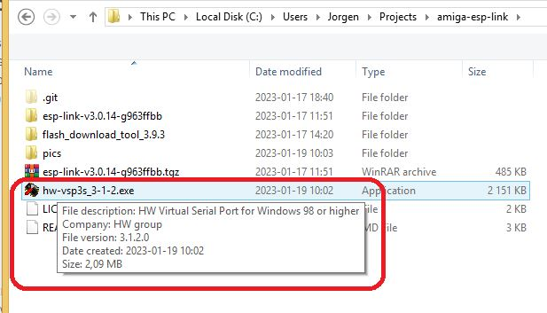
   </a>
   <br />
   <br />
   I chose the default installation options throughout the installation Wizard:<br />
   <a href="pics/amiga-esp-link_pic14.jpg">
   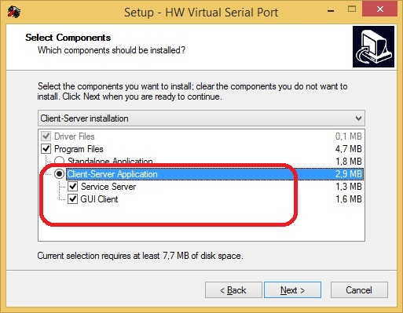
   </a>
   <a href="pics/amiga-esp-link_pic15.jpg">
   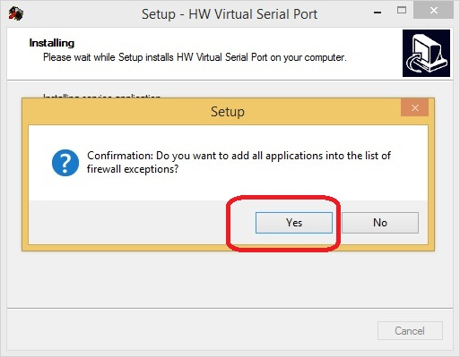
   </a>
   <br />
   <br />
   Now start the HW Virtual Serial Port from the start menu. It is now in read-only mode, click the `Login` button and `OK`, that should elevate permission level to `Admin-access`-mode. Now select a COM-port number you want to create. I chose `COM5` here, also put in the esp-link `IP-address` and port number `2323`, and then click `Create COM` button.<br />
   <a href="pics/amiga-esp-link_pic16.jpg">
   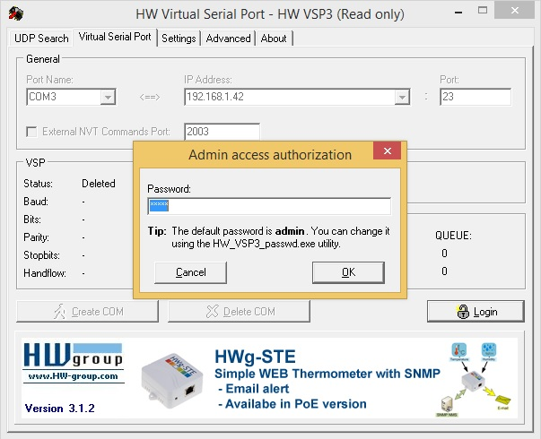
   </a>
   <a href="pics/amiga-esp-link_pic17.jpg">
   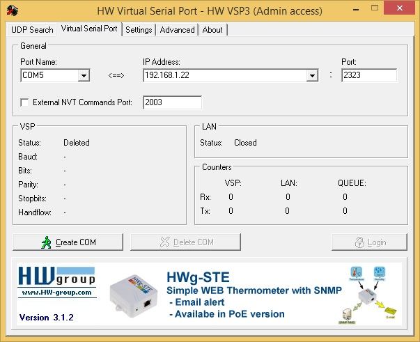
   </a>
   <br />
   <br />
   Great, now the virtual COM-port should have been added. Verify that you now have it displaying in the Device Manager:<br />
   <a href="pics/amiga-esp-link_pic18.jpg">
   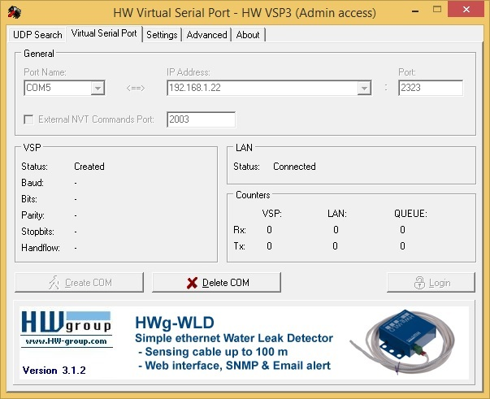
   </a>
   <a href="pics/amiga-esp-link_pic19.jpg">
   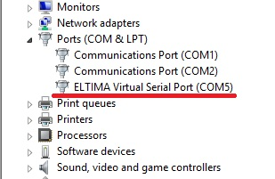
   </a>
   <br />
   <br />
   Now in order to be able to test our newly created COM-port we need a terminal program that can connect via serial. I will use C-Kermit here, but you can use `Putty`, `Tera Term` or `KiTTY` or pick your favorite terminal. The good thing with Kermit is that it has built-in support for old school file transfer protocols such as `Kermit` and `Z-modem` among others.<br />
   <br />
      ```
      [C:\Bin\ckw-b4\] CKW> set protocol ? One of the following:
      kermit      other       xmodem      xmodem-crc  ymodem      ymodem-g    zmodem
      ```
   <br />
   Download and extract C-Kermit for Windows:<br />
   https://github.com/davidrg/ckwin/releases
   <br />
   
   I choose to put it in a Bin folder under `C:\` and then add the folder location to my `Path`-environment variable. This way I can start the console from any location by just typing `k95.exe` on the command line.
   
   <br />
   
   <a href="pics/amiga-esp-link_pic20.jpg">
   
   </a>
   <a href="pics/amiga-esp-link_pic21.jpg">
   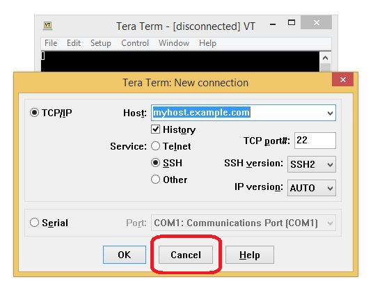
   </a>
   <br />

   Now open a CMD-prompt and type `k95.exe`. You can hold down the shift-key and right-click on the folder and choose `Open command window here`
   
   <br />
   <a href="pics/amiga-esp-link_pic22.jpg">
   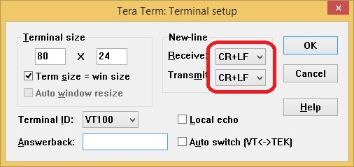
   </a>
   <a href="pics/amiga-esp-link_pic23.jpg">
   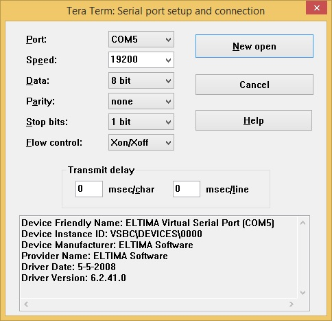
   </a>
   <br />
   We are now ready to test the virtual com port, but first set the correct baud rate in esp-link:
   <br />
   <br />
   <a href="pics/amiga-esp-link_pic24.jpg">
   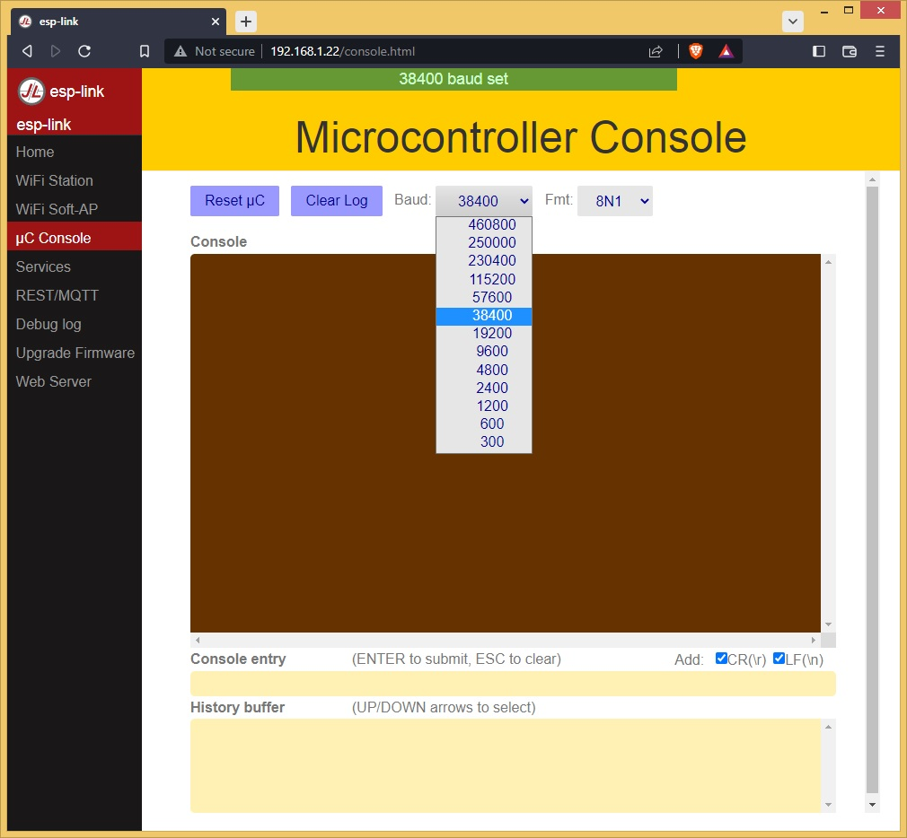
   </a>
   <br />

   Ok great, now in the Kermit terminal set the com-port `set port com5` and your baud speed `set speed 38400` and type `connect` and hit enter. If you type for example `hello` now you should see in the status-window of the virtual port that a connection is open and that it has LAN connected and that the RX- and TX-counters increases as you type.

   <a href="pics/amiga-esp-link_pic25.jpg">
   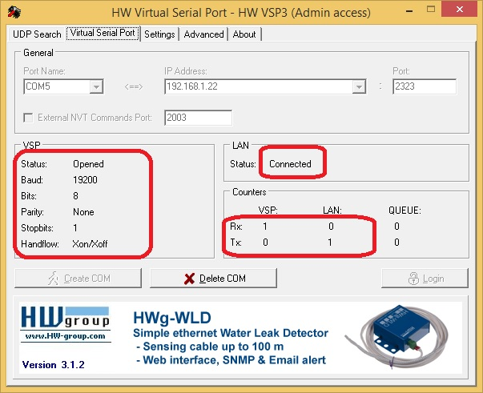
   </a>
   <a href="pics/amiga-esp-link_pic26.jpg">
   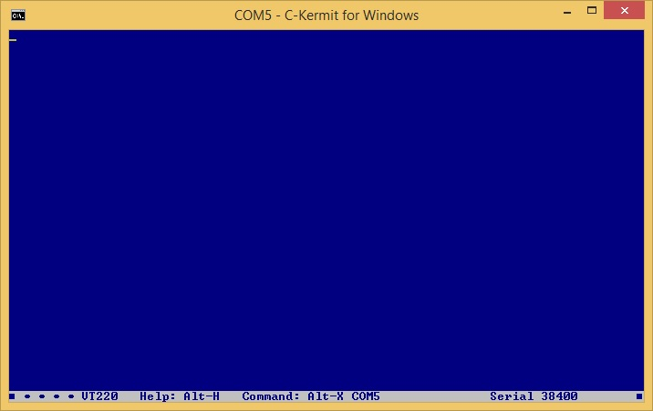
   </a>
   <br />
   
   Sweet! Pat yourself on the back and take a worthwhile coffee break before we hook up the Amiga to the ESP. Well done!
   
   <a href="pics/amiga-esp-link_pic27.jpg">
   
   </a>

***

### Hooking up the Amiga to the ESP-module

9. For this we need some gear:

   <a href="pics/amiga-esp-link_pic28.jpg">
   
   </a>
   
   I have no affiliate or kickback from any of the links below I only show where I sourced the items from:

   * StarTech.com DB9 till DB25 `AT925MF`<br />
      https://www.amazon.com/StarTech-com-DB9-DB25-Seriell-Adapter/dp/B000087RYP/ <br />
      Actually I bought from the Swedish Amazon site: <br />
      https://www.amazon.se/StarTech-com-till-seriell-adapter-beige/dp/B000087RYP/ <br />
      
   <br />
   <a href="pics/amiga-esp-link_pic29.jpg">
   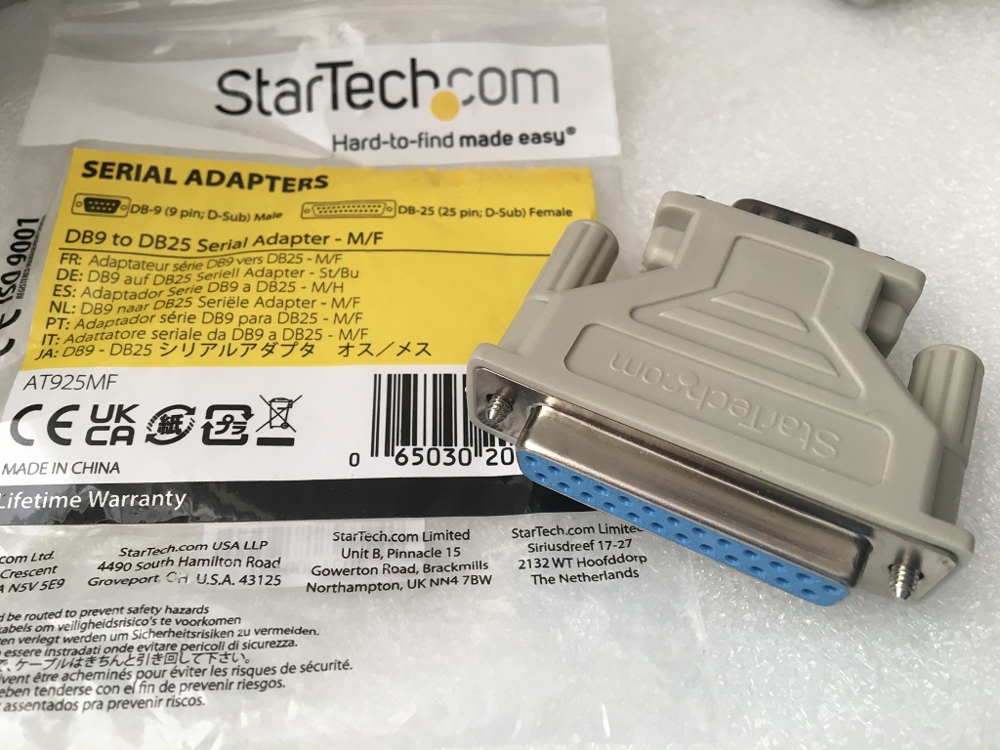
   </a>
   <a href="pics/amiga-esp-link_pic30.jpg">
   
   </a>
   <br />
   <br />
   
   * RS232 Serial to TTL:
      https://www.aliexpress.com/item/1005001685534114.html <br />

   <br />
   <a href="pics/amiga-esp-link_pic31.jpg">
   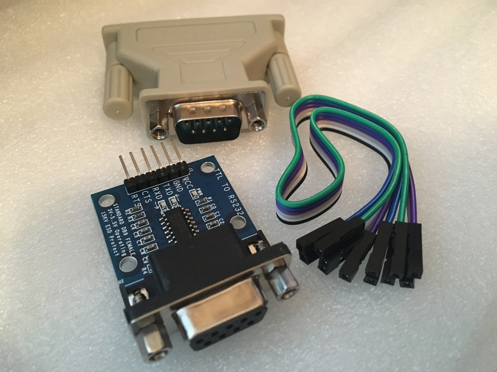
   </a>
   <a href="pics/amiga-esp-link_pic32.jpg">
   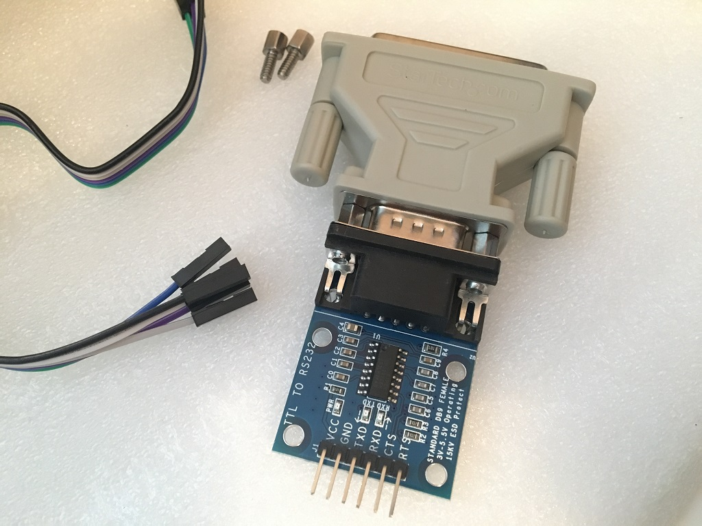
   </a>
   <br />
   <br />
   I had to remove the nuts from one of the sides in order to connect them together. Now you only have to connect them together, Four wires is enough, TX, RX, 3V3 and GND. I connected RTS and CTS here as well but they are not used with esp-link. You can verify that the 3.3V from the ESP is ok before connecting it. The Led on GPIO is optional and only an indicator that the Wifi is online<br />
   <br />
   <a href="pics/amiga-esp-link_pic33.jpg">
   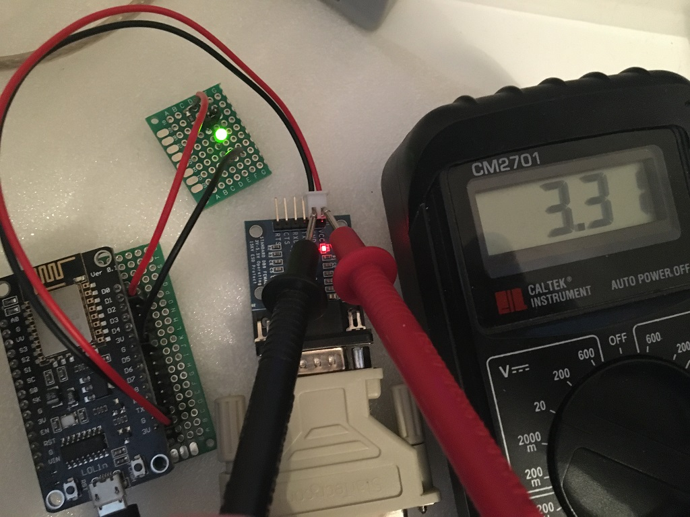
   </a>
   <a href="pics/amiga-esp-link_pic34.jpg">
   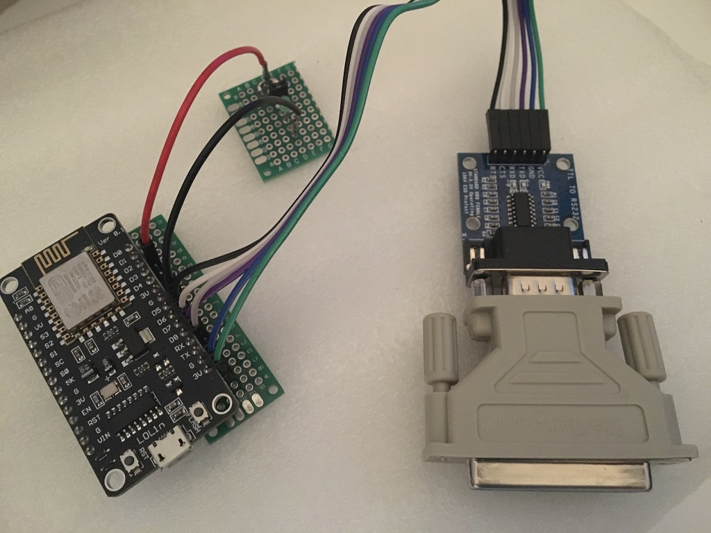
   </a>
   <br />
   <br />
   To power the ESP-module I made a cable to take 5V from the external floppy port of the Amiga. This goes to a micro-usb connector that plugs into the ESP32-module.
   <br />
   <br />
   <a href="pics/amiga-esp-link_pic35.jpg">
   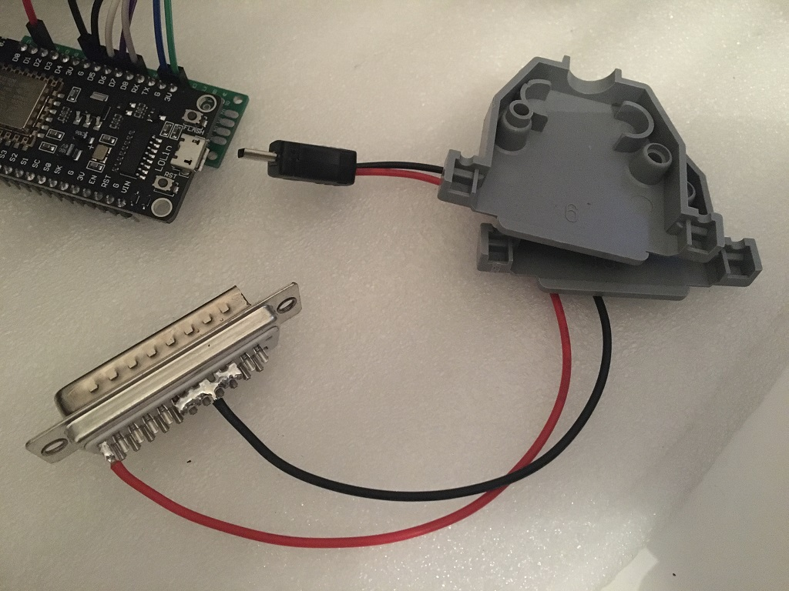
   </a>
   <br />
   
   Now with the ESP-module connected we can start the Amiga kermit client and try and do a file transfer...<br />
   `set line` and `set speed` and the alternative escape sequence (to ctrl + b) with `set esc 2` 
   
   <br />
   <a href="pics/amiga-esp-link_pic36.jpg">
   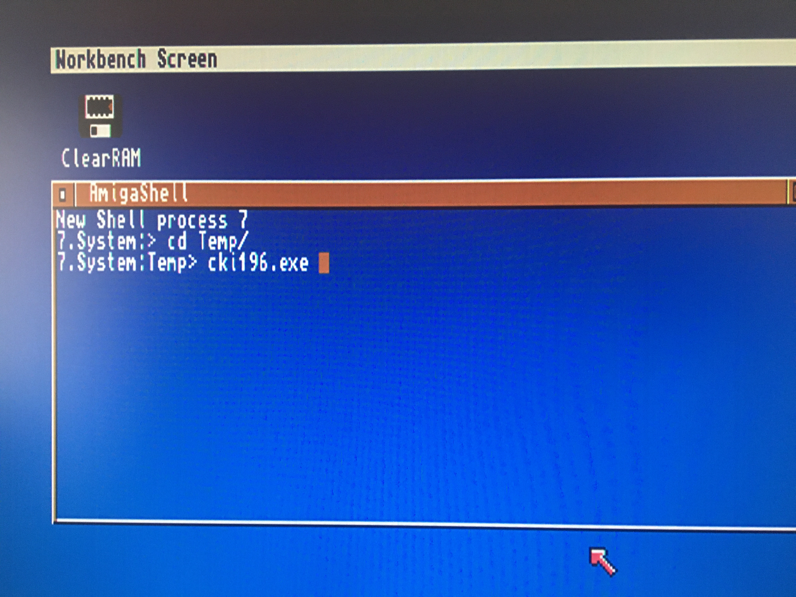
   </a>
   <a href="pics/amiga-esp-link_pic37.jpg">
   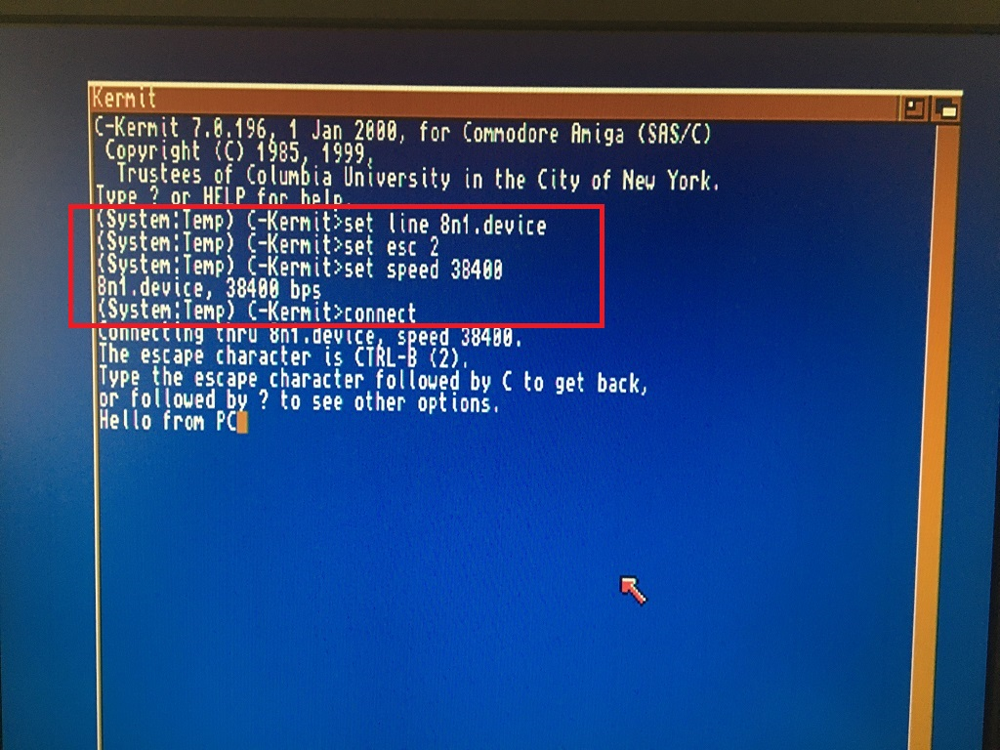
   </a>
   <br />
   
   Now connect and you should be able to chat from one computer to the other by typing in the consoles. Now on the Amiga escape back to the Local System by `ctrl + b` followed by a `c`. Now do a `remote dir`
   
   <br />
   <a href="pics/amiga-esp-link_pic38.jpg">
   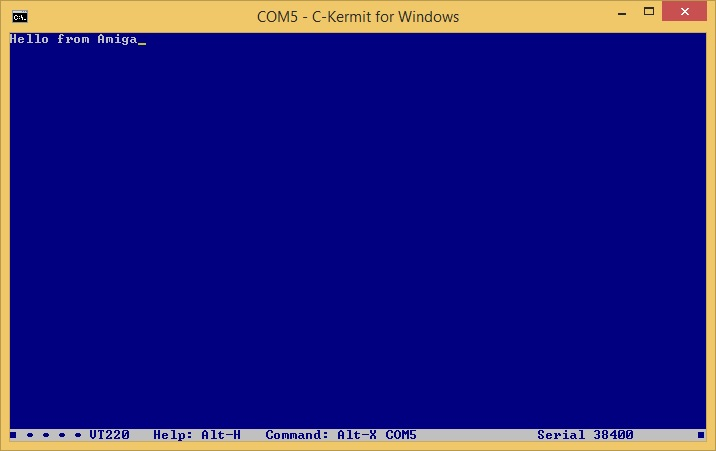
   </a>
   <a href="pics/amiga-esp-link_pic39.jpg">
   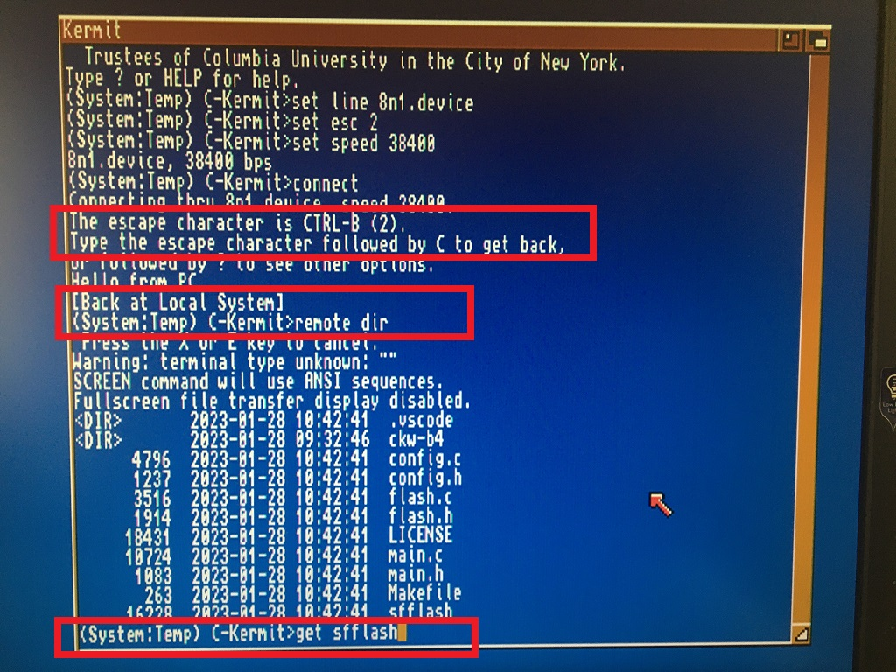
   </a>
   <br />
   
   Now simply type `get` followed by the filename you want to download:
   
   <br />
   <a href="pics/amiga-esp-link_pic40.jpg">
   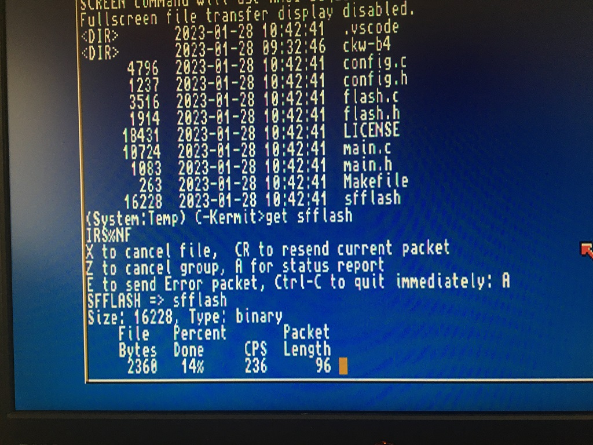
   </a>
   <a href="pics/amiga-esp-link_pic41.jpg">
   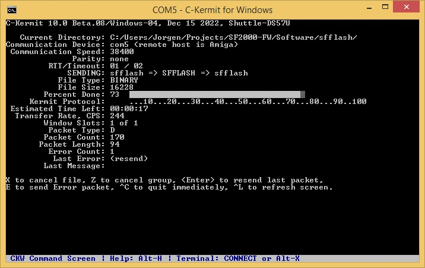
   </a>
   <br />
   <br />
   That's all folks!<br />
   Happy Hackin´
   
   
