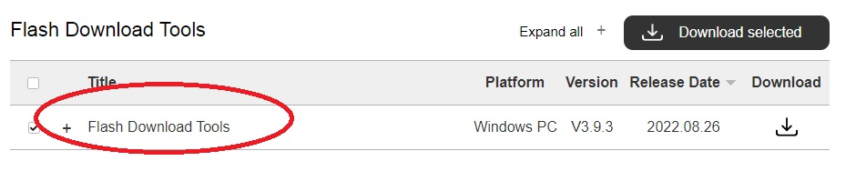
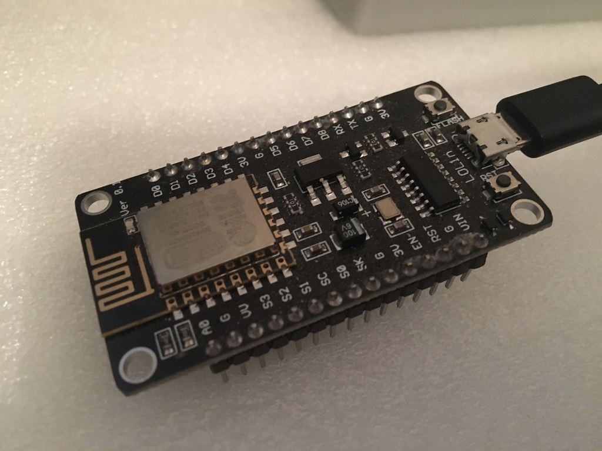
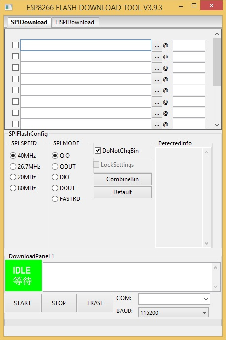
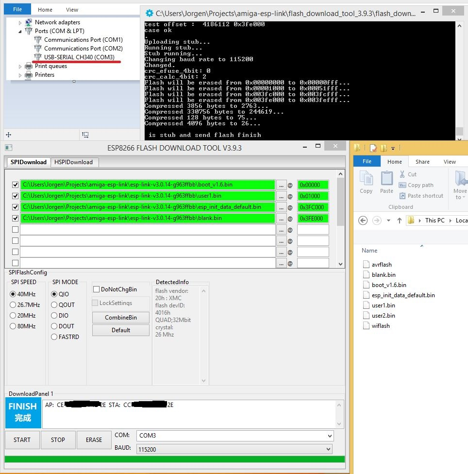
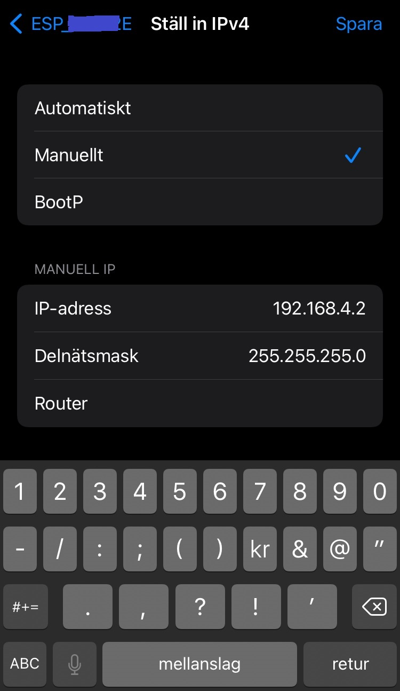
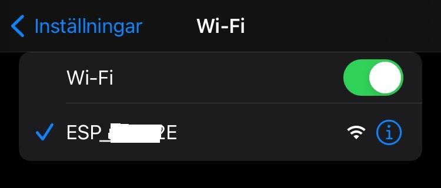
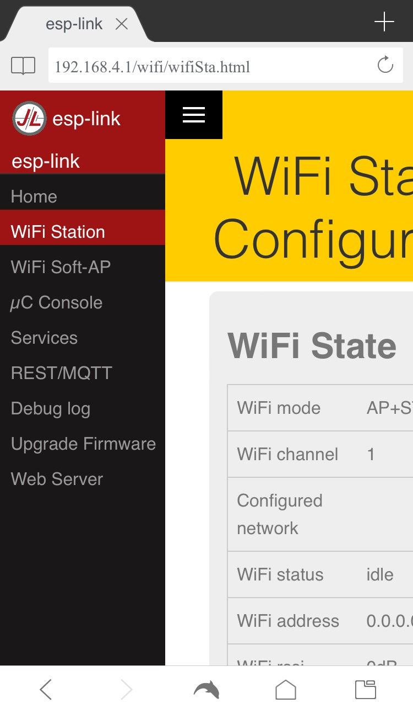
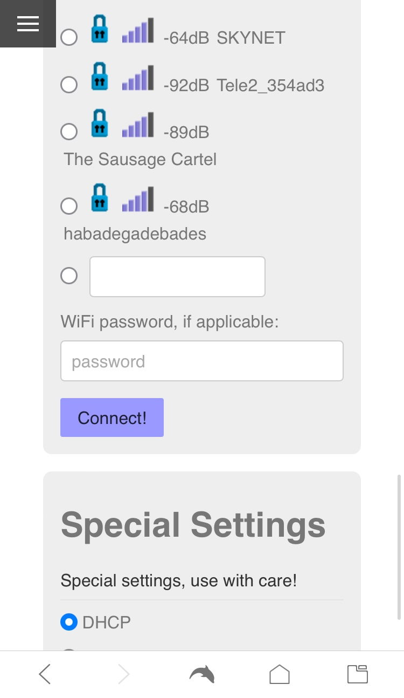

# amiga-esp-link

This document uses the awesome esp-link firmware available here: 
https://github.com/jeelabs/esp-link  

With the wifi-serial bridge we can connect a PC and an Amiga together just like with a null-modem cable (PC ⇄ Amiga) but without having to use a physical cable between the machines.

The esp-link will make it possible to do file transfers over Wi-Fi from the PC to the Amiga and vice versa using a file transfer protocol like `Zmodem` or `Kermit` on each end. A popular program for doing this on the Amiga was [Ncomm](https://aminet.net/search?query=ncomm) back in the days. On the PC side we can use for example `Tera Term` (Windows) or `Minicom` (Linux). 

It's also possible to get Console output of diagrom displayed from your Amiga to your PC this way. No cable needed :) 

No driver needs to be installed on the Amiga side as long as you don't want to replace the `serial.device` that comes with AmigaOS. A better replacement is `8n1.device` available in two versions on Aminet here: https://aminet.net/search?query=8n1   
one is for AmigaDOS 2.04+ (ONLY V37+), pick the correct one for your system. I have successfully used the `8n1.device` driver at `38400` baud speed setting on a plain standard A500.

### Installing esp-link firmware

1. We start by flashing the esp-link to our esp8266 board.  I'm going to do that with the `Flash Download Tools` available from Espressif. 
   First download the Expressif download tool for esp8266 from their site:  
   https://www.espressif.com/en/support/download/other-tools   
    
   
2. Now hook up your ESP8266-board to your PC. I'm using a LoLin NodeMCU V3 board here, pay attention to what COM-port it gets in your system. Mine got COM3 in Windows  
    
   
3. Now start the Flash Tool and select `ESP8266` and `Develop`  
    

4. Ok, good now we follow the instructions on what files to download and put in to our flash download tool. I downloaded the latest stable release `esp-link v3.0.14-g963ffbb` but I could probably have chosen the latest alpha-release instead 
   https://github.com/jeelabs/esp-link/blob/master/FLASHING.md#initial-serial-flashing
    
   
5. Now flash the device usign the Flash Tool, it's important to untick the `DoNotChgBin`-checkbox and put in the correct hex-addresses and COM-port to match your board.   
    

6. If the flashing went well then push the reset-button on your ESP-device and it should now boot and start blinking to show it's now setup as an AP (AccessPoint). You should now be able to connect to it by using for example your phone. Put in a manual IP-address on the same subnet as the AP (192.168.4.0/24). The AP is set to `192.168.4.1` by default so your phone can be set to for example `192.168.4.2` with a netmask of `255.255.255.0`  
   
    
   You should now be able to connect to it: 
    
   
    
   
7. Now point your browser to `http://192.168.4.1` and you should see the esp-link homepage, we now want to put the device into `STA-mode` (Station-mode) so that it can join our home-wifi-network and get an IP from our home router instead so that we can access this page from our PC. Put the device in `AP + STA`-mode and click the `Wifi Station` and select your wifi-network and put in your `WPA2`-password and connect. Do NOT connect to `SkyNet` or `The Sausage Cartel` :)
   
   
   
    
   
   
   
   
